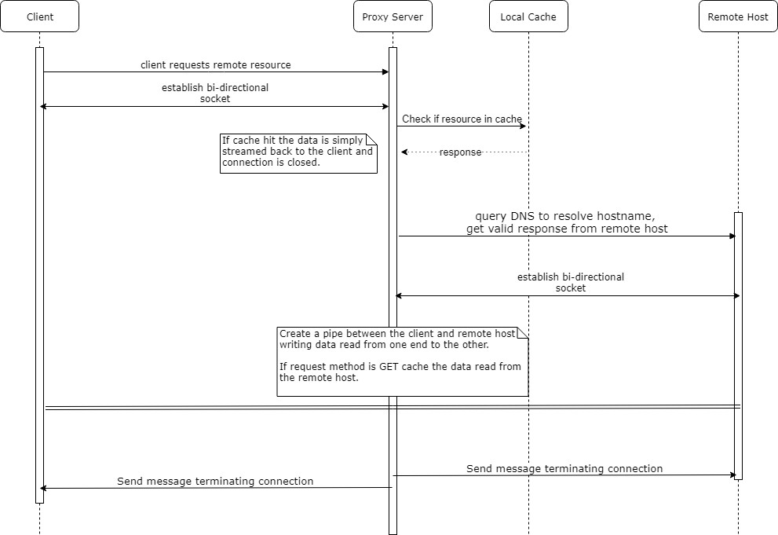
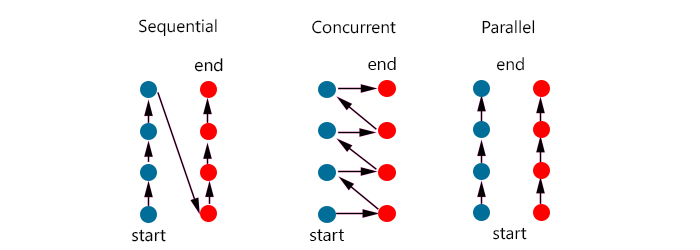

# Asynchronous Proxy Server
### Team-3 Allen & Ryan

## Sequence Diagram

### Primary functions
- serve
- handle_client
- _parse_request
- _check_cache
- _open_remote_connection
- _foward

## Sequential vs. Concurrent vs. Parallel
